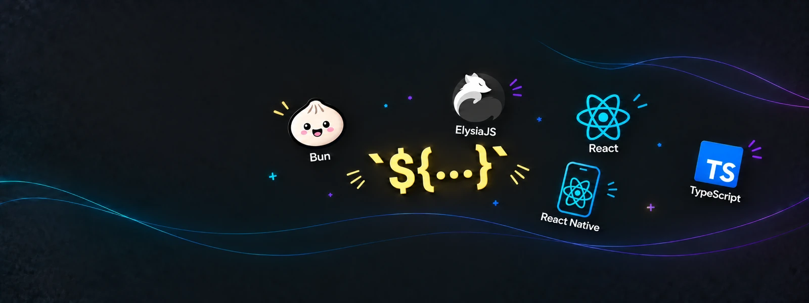

  

<h1 align="center">
  Max Levchuk
   
  AI Engineer
</h1>

  Agent tooling on one side, the product it ships on the other. 
  Bun + ElysiaJS on the server · React on the web · React Native on the phone

  
  

  

---

### Stack

  

  Also day to day: Expo · NativeWind · Drizzle ORM · Turborepo · TanStack Query · Zod · Biome · EAS

 

  Reach me at <a href="mailto:unisol1020@icloud.com">unisol1020@icloud.com</a>

